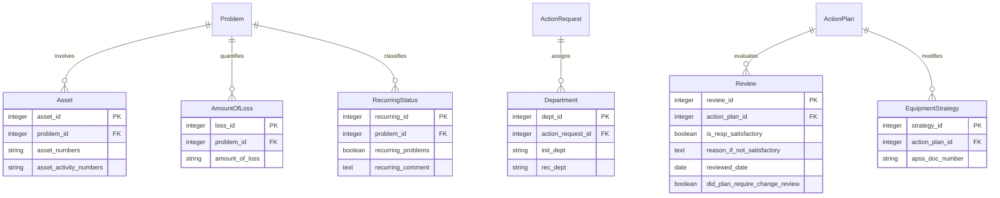

# Mining Reliability Database: Conceptual ERD

## Pattern Analysis: Hierarchical Chain Structure

Pattern exploration of the raw data reveals a natural workflow sequence for incident management. The hierarchical chain pattern better represents this workflow compared to a hub-and-spoke model:

```
Hub-and-Spoke Pattern:            Hierarchical Chain Pattern:
                                  
    ┌─── Problem                  Facility → ActionRequest → Problem → 
    │                                        RootCause → ActionPlan → Verification
ActionRequest ─┼─── RootCause       
    │                            
    └─── ActionPlan              
```

The hierarchical chain better captures the progression of incident management:
1. An incident is reported (ActionRequest)
2. The issue is documented (Problem)
3. The underlying cause is identified (RootCause)
4. Corrective measures are defined (ActionPlan)
5. Effectiveness is verified (Verification)

## 12-Entity Relational Model


## Support Entities



## List Field Extraction Pattern

For fields containing multiple values, extraction follows observed patterns:

1. **Root Cause**: Use tail item (second element) if available
   ```
   RootCause.root_cause = root_cause_list[1] if len(root_cause_list) > 1 else root_cause_list[0]
   ```

2. **Objective Evidence**, **Recommended Action**, **Immediate Containment**: Use head item (first element)
   ```
   ActionPlan.recommended_action = recom_action_list[0] if len(recom_action_list) > 0 else null
   ```

## Sample Data Flow

```
Facility(1, "HUN")
  └── ActionRequest(101, 1, "Conveyor belt failure", stage="Open")
       └── Problem(201, 101, "Tertiary crusher tripped on high vibration")
            └── RootCause(301, 201, "Inadequate training for replacement")
                 └── ActionPlan(401, 301, "Replace filter with upgraded design")
                      └── Verification(501, 401, "Filter replacement effective")
```