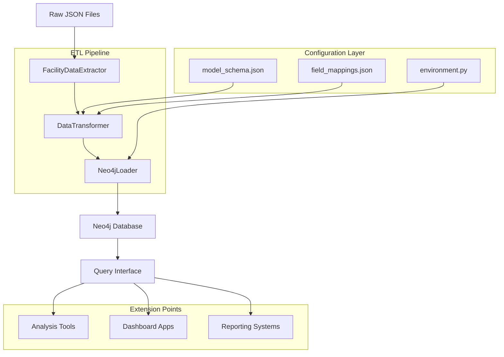

# Mining Reliability Database - Design & Implementation Guide

## Project Overview

The Mining Reliability Database transforms chaotic incident data into a structured graph-based system for mining operations. It converts 41 raw fields into a 12-entity workflow model that follows natural incident management progression.

## Core Design Principles

### **Schema-Driven Architecture**
- All entity definitions, relationships, and transformations defined in JSON configuration
- No hardcoded business logic - everything configurable through `configs/` directory
- Single source of truth for data model changes

### **Hierarchical Chain Model**
Instead of hub-and-spoke data scattered around incidents, the system models workflow progression:

```
Facility → ActionRequest → Problem → RootCause → ActionPlan → Verification
```

This captures how mining incidents actually flow through organizational processes.

### **Configuration-First Design**
- Field mappings externalized to JSON
- Entity loading order defined in constants
- Relationship configurations centralized
- Environment-driven deployment settings

## Implementation Architecture

### **Core Components**

```
configs/                    # Configuration layer
├── model_schema.json      # Entity definitions & relationships
├── field_mappings.json    # Raw data → entity transformations
└── environment.py         # Single config access point

mine_core/                 # Business logic layer
├── shared/               # Common utilities
├── database/            # Neo4j operations
├── pipelines/          # ETL processes
└── entities/          # Schema-driven models

scripts/                  # CLI interface layer
├── create_schema.py    # Database initialization
├── import_data.py     # Data loading
└── reset_db.py       # Database management
```

### **Data Flow Pattern**

1. **Extract**: JSON files → structured records
2. **Transform**: Raw fields → entity model using mappings
3. **Load**: Entity batches → Neo4j graph with relationships

### **Key Technical Decisions**

**Graph Database Choice**: Neo4j selected for relationship-heavy incident data where connections between causes, actions, and outcomes are critical for analysis.

**Batch Processing**: All operations use configurable batch sizes to handle large facility datasets efficiently.

**Primary Key Strategy**: Schema-driven ID management eliminates manual key coordination across 12 entities.

## Workflow Diagram



## Extension Strategies

### **Dashboard Integration**

**Web Dashboard**: Build Flask/FastAPI service using `mine_core.database.queries` module
```python
from mine_core.database.queries import get_facilities, get_incident_chain
# Dashboard endpoints consume existing query functions
```

**Real-time Analytics**: Connect BI tools (Tableau, Power BI) directly to Neo4j using Cypher queries

**Custom Visualizations**: Use `pyvis` or `networkx` for graph visualizations of incident relationships

### **API Development**

**REST API**: Expose core queries through standard HTTP endpoints
```python
# Example endpoint structure
GET /api/facilities
GET /api/facilities/{id}/incidents
GET /api/incidents/{id}/chain
```

**GraphQL Interface**: Natural fit for graph data - expose Neo4j schema through GraphQL resolvers

### **Advanced Analytics**

**Pattern Recognition**: Add ML models to identify recurring incident patterns using relationship analysis

**Predictive Analytics**: Extend with time-series analysis for incident forecasting

**Root Cause Intelligence**: Build recommendation engines for action plan effectiveness

### **Data Integration**

**Additional Sources**: Extend `pipelines/extractor.py` for new data formats (CSV, APIs, databases)

**Real-time Feeds**: Add streaming data connectors for live incident reporting

**External Systems**: Integrate with CMMS, ERP systems through adapter pattern

## Technical Extension Points

### **New Entity Types**
Add entities to `model_schema.json`:
```json
{
  "name": "SafetyMetric", 
  "properties": {...},
  "relationships": [...]
}
```

### **Custom Transformations**
Extend `field_mappings.json` for new data sources:
```json
{
  "entity_mappings": {
    "NewEntity": {
      "field_name": "source_field"
    }
  }
}
```

### **Query Extensions**
Add functions to `mine_core/database/queries.py`:
```python
def get_safety_trends(facility_id, date_range):
    # Custom analytics queries
```

## Deployment Patterns

### **Development Setup**
```bash
make dev-setup    # Complete development environment
make schema       # Initialize database
make import       # Load sample data
```

### **Production Deployment**
- Docker containers for Neo4j and application
- Environment variables for all configuration
- Automated schema migration through scripts

### **Cloud Integration**
- Azure/AWS Neo4j managed services
- Container orchestration (Kubernetes)
- CI/CD pipeline integration

## Performance Considerations

### **Scalability Factors**
- **Batch Size Tuning**: Configurable through `mine_core.shared.constants`
- **Index Strategy**: Primary key constraints automatically created
- **Memory Management**: Connection pooling and session lifecycle management

### **Query Optimization**
- Relationship traversal queries optimized for incident chain analysis
- Indexed lookups on facility and action request identifiers
- Aggregation queries designed for reporting workloads

## Maintenance Strategy

### **Configuration Management**
- Schema changes through JSON updates
- Field mapping adjustments without code changes
- Environment-specific deployments through variable substitution

### **Data Quality**
- Validation rules embedded in schema definitions
- Error handling with detailed logging
- Batch operation rollback capabilities

## Strategic Implications

This architecture enables mining operations to:

**Identify Systemic Issues**: Graph relationships reveal recurring problem patterns across facilities

**Measure Action Effectiveness**: Track verification outcomes to optimize response strategies

**Accelerate Root Cause Analysis**: Relationship traversal speeds incident investigation

**Enable Predictive Maintenance**: Historical patterns inform proactive interventions

The schema-driven, configuration-first design ensures the system adapts to evolving operational requirements without extensive code modifications.